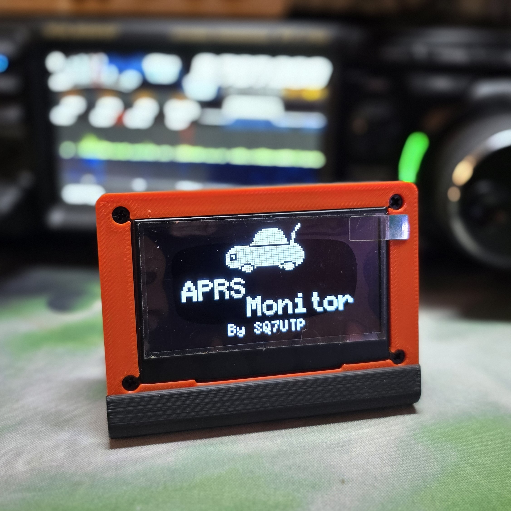
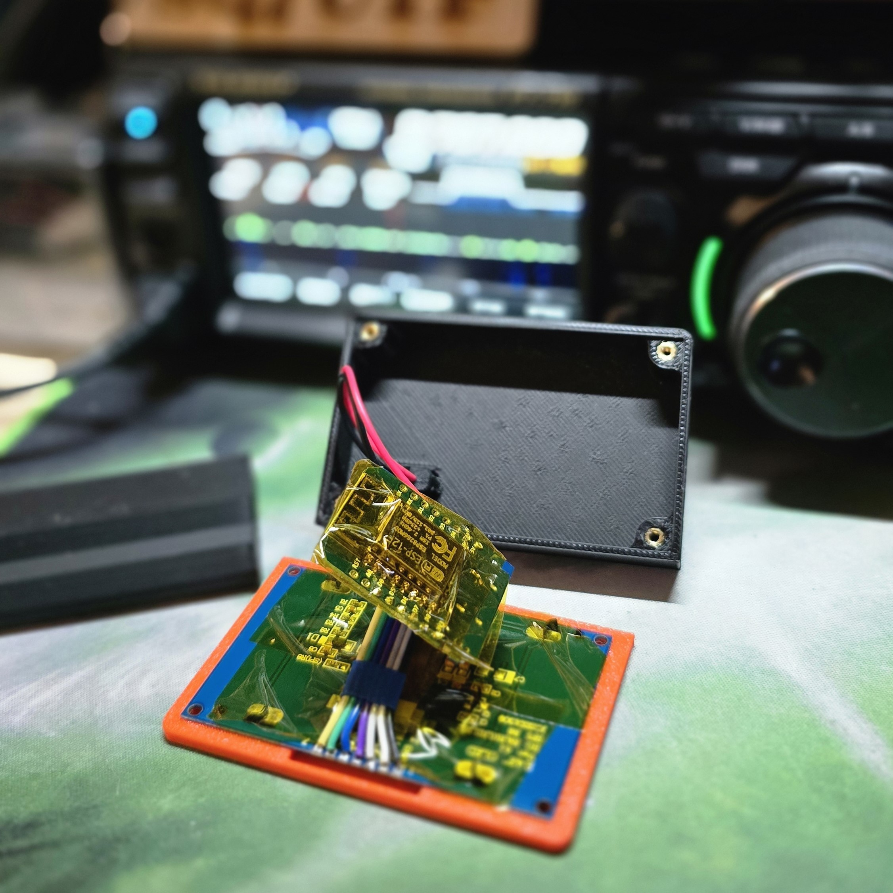
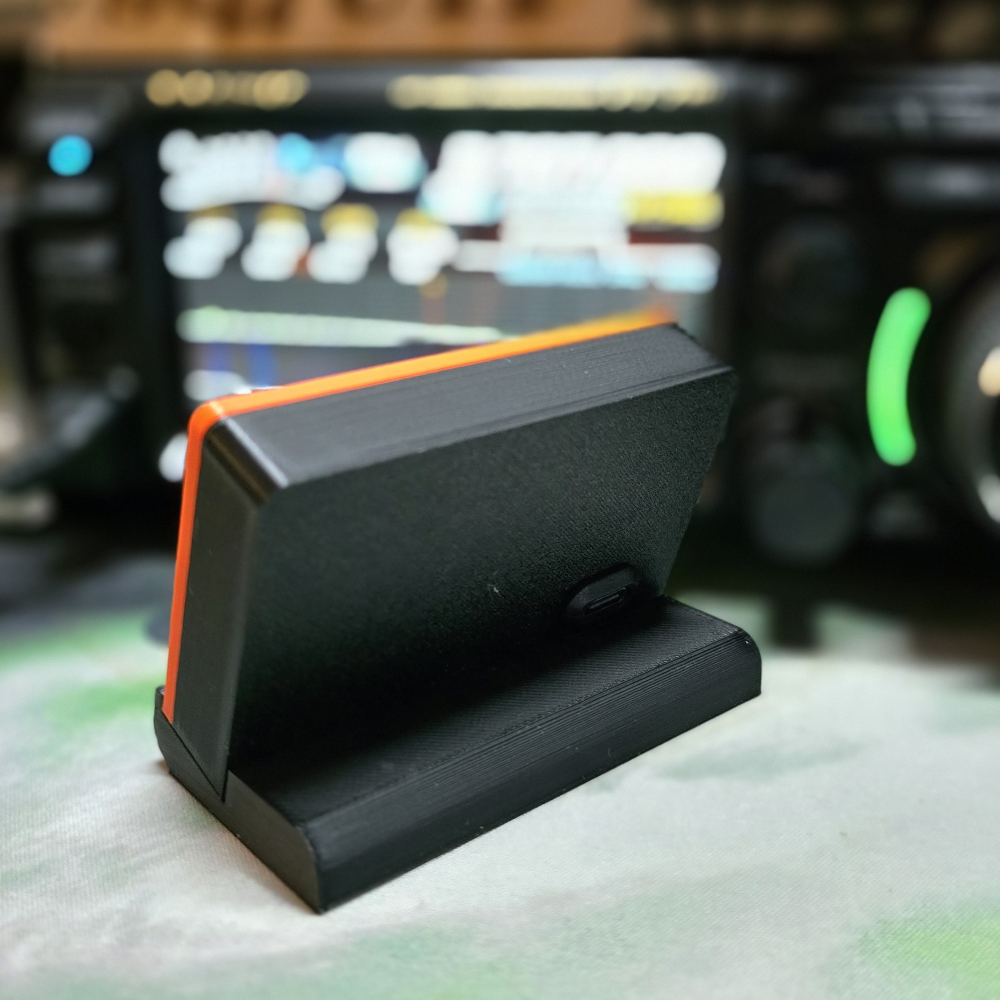
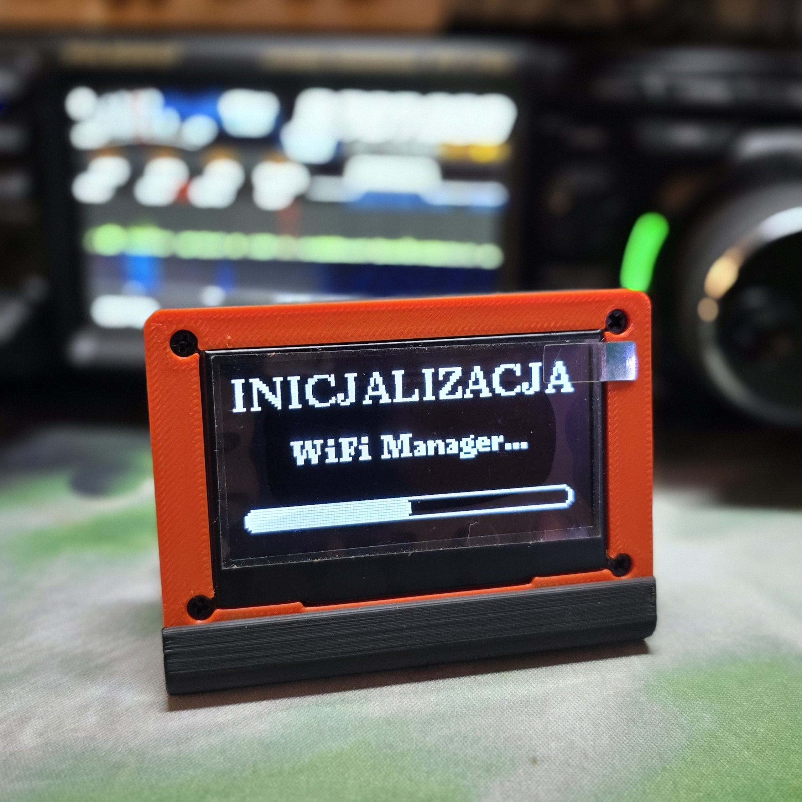
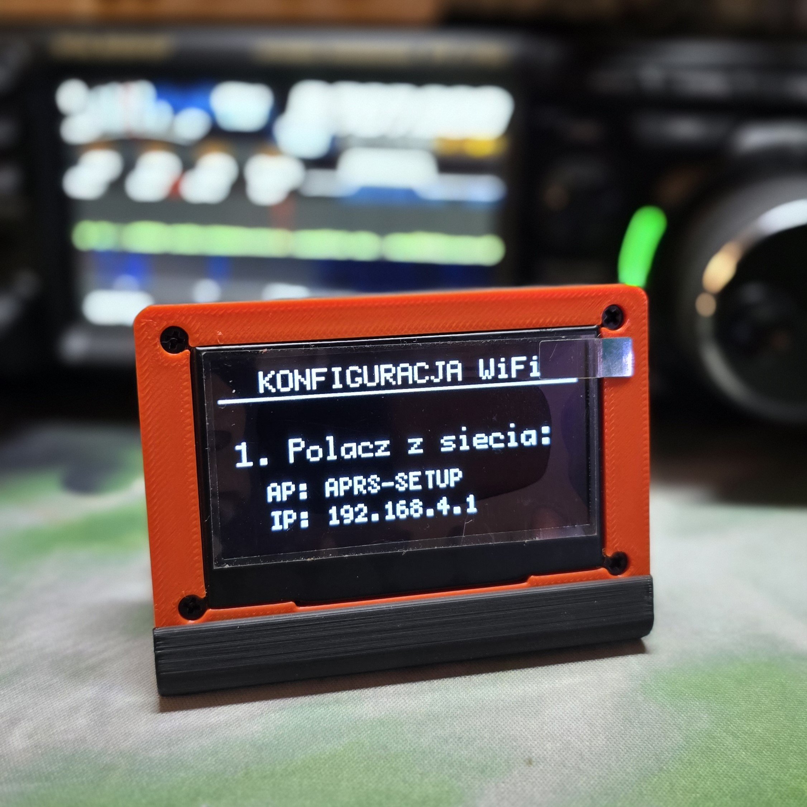
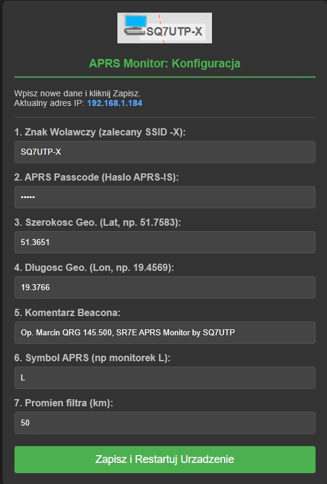
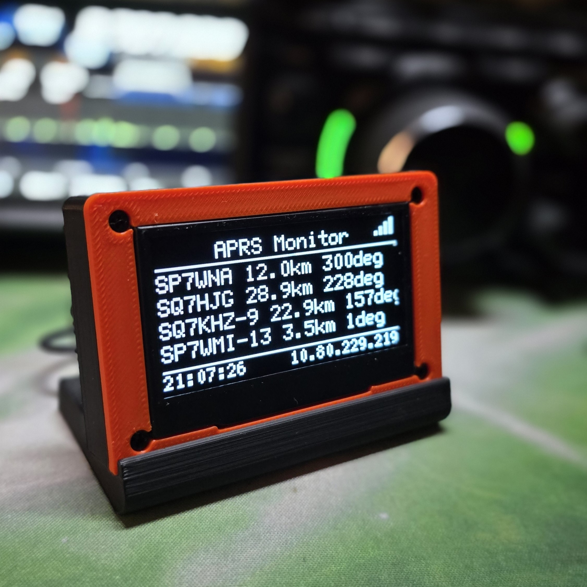
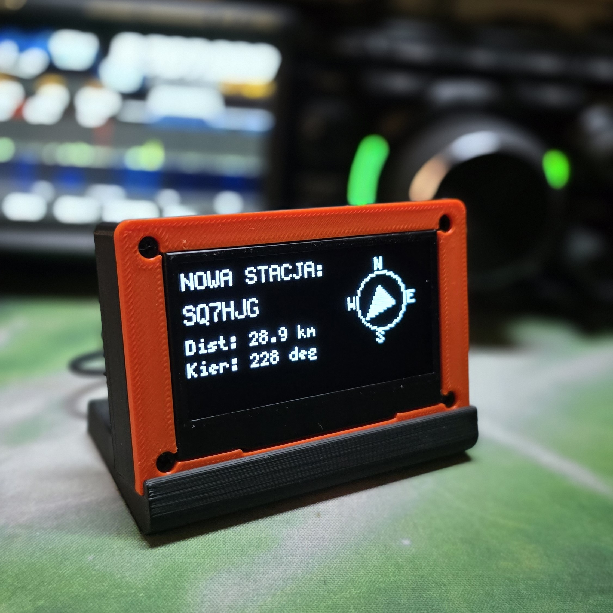
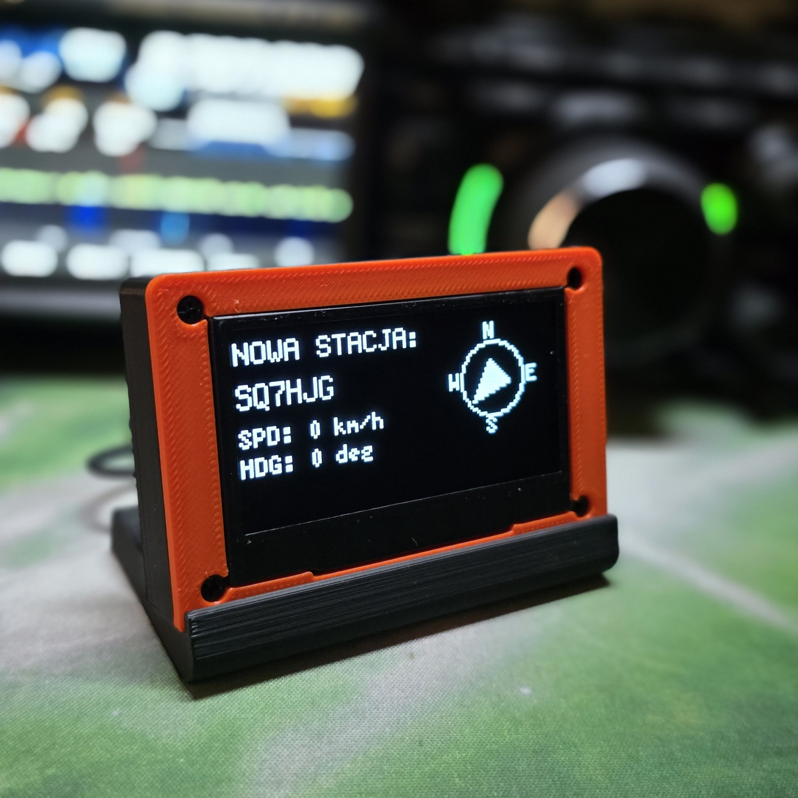
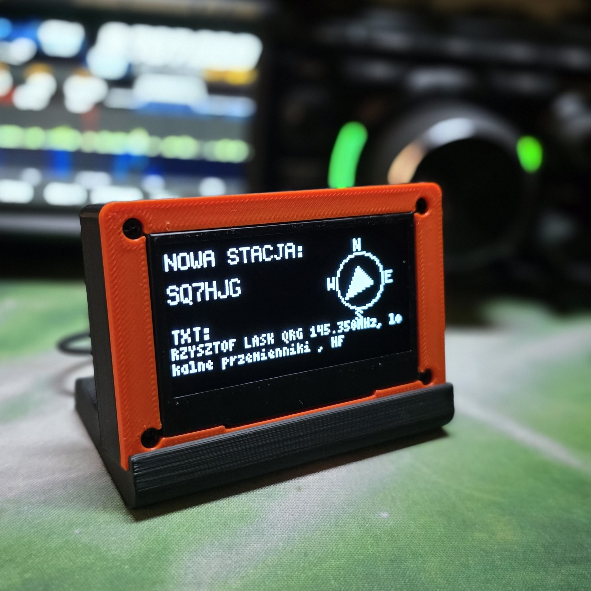

# APRS Monitor V1.2 (ESP8266 + OLED 2.42" SSD1309) 📡

  

**APRS Monitor V1.2** to rozbudowana wersja samodzielnego urządzenia opartego na mikrokontrolerze ESP8266, które łączy się z serwerami APRS-IS przez WiFi, nasłuchuje ruchu w określonym promieniu od Twojej lokalizacji i wyświetla informacje o stacjach na **dużym, czytelnym ekranie OLED 2.42"**.

**Autor:** Marcin "Skrętka" (SQ7UTP)
📧 **Kontakt:** sq7utp@gmail.com

## 🌟 Funkcjonalności

* **Duży Ekran:** Obsługa wyświetlacza **2.42" SSD1309** (128x64) zapewniająca świetną czytelność.
* **Monitorowanie na żywo:** Odbiór ramek APRS z serwerów Tier 2 (domyślnie `lodz.aprs2.net`).
* **Geolokalizacja:** Obliczanie odległości i azymutu (kierunku) do odbieranych stacji względem Twojej pozycji.
* **Tryb Smart Display:**
    * *Lista:* Przewijana lista ostatnich stacji.
    * *Szczegóły:* Gdy nadejdzie nowy pakiet, ekran automatycznie pokazuje duży znak, strzałkę kierunkową, prędkość, kurs i komentarz.
* **Konfiguracja przez WiFi:** Brak konieczności edycji kodu! Wszystkie ustawienia (Znak, Hasło, Koordynaty, Filtry) wprowadzasz przez przeglądarkę w telefonie/komputerze.
* **Web Panel:** Możliwość zmiany konfiguracji w trakcie pracy urządzenia bez konieczności resetowania do ustawień fabrycznych.
* **Beacon:** Urządzenie wysyła własną ramkę pozycyjną (SmartBeaconing - interwał czasowy).

## 🛠️ Wymagany Sprzęt

1.  **Mikrokontroler:** ESP8266 (rekomendowany Wemos D1 Mini ze względu na obudowę).
2.  **Wyświetlacz:** OLED **2.42"** SPI na sterowniku **SSD1309** (128x64).
    * *Uwaga: Wymaga podłączenia przez interfejs SPI (7 pinów).*
3.  **Zasilanie:** Kabel Micro-USB lub USB-C (w zależności od wersji Wemosa).

  
  

### Schemat połączeń (SPI Software - 7 Pinów)
Kod używa programowego SPI (Software SPI) na następujących pinach:

| Pin Wyświetlacza (SSD1309) | ESP8266 (Wemos D1 Mini) | Funkcja |
| :--- | :--- | :--- |
| **GND** | **GND** | Masa |
| **VCC** | **3.3V** | Zasilanie |
| **SCL / D0** (Clock) | **D5** (GPIO 14) | Zegar (Clock) |
| **SDA / D1** (Data) | **D7** (GPIO 13) | Dane (MOSI) |
| **RES** (Reset) | **D0** (GPIO 16) | Reset |
| **DC** (Data/Command) | **D6** (GPIO 12) | Sterowanie danymi |
| **CS** (Chip Select) | **D8** (GPIO 15) | Wybór układu |

> **Ważne:** Upewnij się, że zworki z tyłu wyświetlacza są ustawione na tryb SPI (zazwyczaj domyślny), a nie I2C.

## 🖨️ Obudowa (Druk 3D)

Dla tej wersji projektu (z ekranem 2.42") wymagana jest większa obudowa.

🔗 **Pobierz model:** [2.42in OLED case with optional platform (Printables)](https://www.printables.com/model/441957-242in-oled-case-with-optional-platform)

## 📦 Instalacja Oprogramowania

1.  Zainstaluj środowisko **Arduino IDE**.
2.  Dodaj obsługę płytek ESP8266 w Menedżerze Płytek.
3.  Zainstaluj wymagane biblioteki (Szkic -> Dołącz bibliotekę -> Zarządzaj bibliotekami):
    * `U8g2` (autor: oliver)
    * `WiFiManager` (autor: tzapu)
    * `ArduinoJson` (wersja 6.x)
4.  Wybierz w Arduino IDE odpowiednią płytkę (np. "LOLIN(WEMOS) D1 R2 & mini").
5.  Upewnij się, że masz zainstalowaną wtyczkę/narzędzie do przesyłania plików **LittleFS** (opcjonalne, kod sam sformatuje pamięć przy pierwszym uruchomieniu, ale warto o tym pamiętać).
6.  Wgraj szkic (`APRS_Monitor_SSD1309.ino`) do urządzenia.

## 🚀 Pierwsze Uruchomienie i Konfiguracja

Urządzenie po pierwszym uruchomieniu (lub gdy nie znajdzie znanej sieci) wejdzie w tryb **Access Point**.

1.  Wyszukaj na telefonie/komputerze sieć WiFi o nazwie: `APRS-SETUP`.
2.  Połącz się z nią (hasło nie jest wymagane).
3.  Powinno automatycznie otworzyć się okno konfiguracji (Captive Portal). Jeśli nie, wejdź w przeglądarce na adres `192.168.4.1`.

  
  

4.  Wybierz swoją domową sieć WiFi i wpisz do niej hasło.
5.  Uzupełnij parametry APRS w formularzu:
    * **Znak:** Twój znak krótkofalarski z SSID (np. SQ7UTP-X) <-- ( -X jak najbardziej zalecane! ).
    * **Hasło APRS:** (Passcode)
    * **Ikonka APRS:** Polecam wpisać **L**
    * **Lat/Lon:** Twoje współrzędne geograficzne (np. 51.75 / 19.45).
    * **Komentarz:** Komentarz który będzie wysyłany z BEACON
    * **Filtr:** Promień nasłuchu w kilometrach (np. 50).

  

     
6.  Zapisz. Urządzenie zrestartuje się i połączy z siecią.

## 📖 Instrukcja Obsługi

### Ekran Główny (Lista)
Po uruchomieniu zobaczysz listę ostatnio odebranych stacji.
* Format: `ZNAK | DYSTANS | AZYMUT`
* Na dole paska: Zegar (pobierany z NTP) oraz Twój adres IP.

### Ekran Nowej Stacji
Gdy urządzenie odbierze nowy pakiet, przełączy się na 12 sekund w tryb szczegółowy:
* Wyświetla duży Znak i strzałkę kierunkową (N/S/W/E).
* Cyklicznie zmienia informacje na dole:
    1.  Dystans i Kierunek (deg).
    2.  Prędkość (km/h) i Kurs (Heading).
    3.  Komentarz (Beacon text).

  
  

  
  

### Zmiana Ustawień (Web Panel)
Gdy urządzenie jest połączone z Twoją siecią, wpisz jego adres IP (widoczny na dole ekranu OLED) w przeglądarce. Otrzymasz dostęp do panelu, gdzie możesz zmienić promień filtra, ikonę lub komentarz bez resetowania urządzenia.

## 📜 Licencje i Odpowiedzialność

Projekt składa się z dwóch niezależnych części objętych różnymi licencjami:

1.  **Kod Źródłowy:** `GNU GPL v3`
    * **Autor:** Marcin "Skrętka" (SQ7UTP)
    * **Podziękowania:** Jacek (SP7EZD) za wsparcie merytoryczne.
    * **Zasady:** Otwarty kod źródłowy, dozwolone modyfikacje i redystrybucja pod tą samą licencją.
    * **Odpowiedzialność:** Oprogramowanie jest dostarczane w stanie "takim, jakie jest" (AS IS), bez jakiejkolwiek gwarancji. Autor nie ponosi odpowiedzialności za ewentualne szkody sprzętowe, błędy w działaniu lub skutki prawne wynikające z użytkowania urządzenia. **Wszystkie modyfikacje sprzętowe i programowe wykonujesz na własną odpowiedzialność.**

2.  **Model Obudowy 3D:** `CC BY-NC 4.0`
    * **Autor modelu:** (Link do Printables w sekcji Obudowa)
    * **Zasady:** Dozwolone modyfikacje i druk na użytek własny.
    * **Ograniczenia:** Zabronione wykorzystanie komercyjne (sprzedaż wydruków) bez zgody autora modelu.

---
*73 i udanych nasłuchów!*
